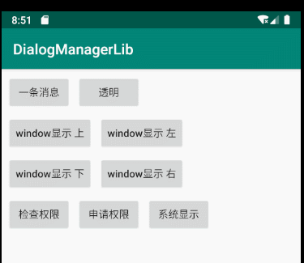

## Dialog

### 引入

```
implementation 'tech.liujin:dialogManager:1.0.3'
```

### 示例


### window弹窗

> 显示在activity所属的window里

```
View view = getLayoutInflater().inflate( R.layout.message_text, null );
WindowDialogManager.showActivityDialogTop( this, view );
```




### 系统级window弹窗(需要权限SYSTEM_ALERT_WINDOW)

```
View view = getLayoutInflater().inflate( R.layout.message_text, null );
try {
      WindowDialogManager.showAppDialogTop( this, view );
} catch(Exception e) {
      e.printStackTrace();
}
```